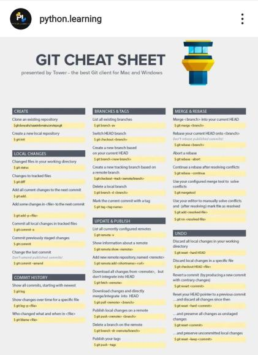

## Louis Sungwoo Cho Engineering & Computer Science Resources 
All the useful resources I have been using to study for **engineering** and **computer science** courses. Courses include from **Civil & Environmental Engineering, Computer Science** and more. Many **Civil & Environmental Engineering** courses I took are **Transportation Engineering** courses because that is my primary specialization for my **CEE** major, likewise many **Computer Science** courses are **Artificial Intelligence & Big Data** courses since that is my focus area in my **CS** minor. My primary programming language is **Python** so many of my projects are programmed in **Python**. Please refer to the **00Python** folder. For full-stack web development projects, I frequently use **HTML, CSS, JavaScript** and more useful built-in packages. I also have all the **LeetCode** questions that I have been grinding in **Python** while taking **CS 374 Introduction to Algorithms & Models of Computation** at **UIUC** in the **03CODING_INTERVIEWS** folder. 

## Contributors:
- ### Louis Sungwoo Cho 조성우 

## Good Study Songs:
  - [Korean Rap Playlist 한국랩 모음](https://open.spotify.com/playlist/4MKcxPEZhNdkwtceHZhW3p)
  - [Korean Pop Music Playlist 한국노래 모음](https://open.spotify.com/playlist/4LsC7WDPeSb8kZcoVdjEsJ)
  - [30 IU Songs](https://www.youtube.com/watch?v=YlY2CJaErdE)
  - [IU Songs in Piano 아이유 피아노 모음](https://www.youtube.com/watch?v=v4eYO7qKVzA)
  - [Pop Songs Playlist 팝 모음](https://open.spotify.com/playlist/5HJntlLQbwMmOiBU6z4qUC)
  
## GitHub Commands:

### GitHub Commands I always use:
    git pull
    git add .
    git commit -m "commiting files to my GitHub repository"
    git push origin main

# ALL PYTHON STUFF:
 - ## Introduction to Python
 - **[0] [Python Documentation](https://docs.python.org/3.8/tutorial/)**
 - **[1] [Corey Schafer Introductory Python Tutorial](https://youtube.com/playlist?list=PL-osiE80TeTt2d9bfVyTiXJA-UTHn6WwU)**
 - **[2] [Tech with Tim Object-Oriented Programming in Python](https://www.youtube.com/watch?v=JeznW_7DlB0)**
 - **[3] [Tech with Tim Pygame Tutorial](https://www.youtube.com/watch?v=jO6qQDNa2UY)**
 - ## Data Structures in Python
 - **[0] [Jovian Introductory Data Structures & Algorithms Python Tutorial](https://youtu.be/pkYVOmU3MgA)**
 - ## Algorithms in Python
 - **[0] Scroll down to CS 374**
 - ## Data Science & Analytics in Python
 - **[0] [Mr. P Solver SciPy Tutorial](https://www.youtube.com/watch?v=jmX4FOUEfgU)**
 - **[1] [Time-Series Windows 10 Prophet Installation](https://stackoverflow.com/questions/53178281/installing-fbprophet-python-on-windows-10)**
 - **[2] [Time-Series Prophet Stuff](https://facebook.github.io/prophet/docs/quick_start.html)**
 - **[3] [Professor Wade Fagen-Ulmschneider and Karlie Flanagan's guide to Data Science with Python](https://discovery.cs.illinois.edu/learn/)**
 - ## System Programming in Python
 - **[0] [Tech with Tim Python Socket Programming](https://www.youtube.com/watch?v=3QiPPX-KeSc)**

 
### 파이썬 한국어 버전
 - **[0] [나도코딩 파이썬 기초](https://www.youtube.com/watch?v=kWiCuklohdY)**
 - **[1] [GongbroDesk 파이썬 기초](https://www.youtube.com/watch?v=8_VWnRvbGPs)**

## UIUC Grainger College of Engineering Courses
I am majoring in **Civil & Environmental Engineering** specializing in **Transportation Engineering** and minoring in **Computer Science** with a focus area in **Artificial Intelligence & Big Data**. Here are the resources I had to use to study for the engineering and computer science courses I took at the University of Illinois at Urbana-Champaign. 

### Legend:
  - **CEE: Civil & Environmental Engineering**
  - **CS: Computer Science**
  - **ECE: Electrical & Computer Engineering**
  - **ME: Mechanical Engineering**
  - **AE: Aerospace Engineering**
  - **SE: Systems Engineering & Design**
  - **IE: Industrial Engineering**
  - **TAM: Theoretical & Applied Mechanics**
  - **MATH: Mathematics**
  - **STAT: Statistics**
  - **PHYS: Physics**
  - **CHEM: Chemistry**

### Civil & Environmental Engineering (Specialization: Transportation Engineering):
- **CEE 400 lvl Rail (1.00) TBA**
- **CEE 400 lvl Facilitites (2.00 or 2.50) TBA**
- **CEE 415 Geometric Design of Roads (3.00)**
- **CEE 416 Traffic Capacity Analysis (1.50)**
  - **[0] [Ali Hajbabaie Traffic Engineering](https://youtube.com/playlist?list=PLneifN52CCdu_uMCA-R6zHD_1YYxVS0Oe)**
  - **[1] [Meead Saberi Traffic Engineering](https://www.youtube.com/user/meeadsk/videos)**
  - **[2] [Shockwave Example](https://www.youtube.com/watch?v=9QFy9iREWsY)**
  - **[3] [Freeway Analysis](https://www.youtube.com/watch?v=vvFC4gyw81A)**
- **CEE 418 Public Transportation Systems (1.00)**
  - **[0] [MIT Public Transportation Systems](https://youtube.com/playlist?list=PLUl4u3cNGP62AU7iNniqVoMl8C64tIOVk)**
- **CEE 310 Transportation Engineering (1.00)**
  - **[0] [Fundamentals of Transportation](https://en.wikibooks.org/wiki/Fundamentals_of_Transportation)**
  - **[1] [Professor Lewis Lehe Transportation Engineering Website](https://trafficvis.com/)**
  - **[2] [Louis Sungwoo Cho's Transportation Engineering Resources](https://github.com/lotlouischoitslab/Transportation_Engineering)**
- **CEE 320 Construction Engineering (1.50)** 
  - **[0] [Project Management for Construction](https://www.cmu.edu/cee/projects/PMbook/)**
  - **[1] [Engineer4Free Project Management](https://youtube.com/playlist?list=PLOAuB8dR35oeyKU0ojIxD8Muf6Mwc8ugW)**
  - **[2] [Critical Path Method in Python](https://pypi.org/project/criticalpath/)**
- **CEE 350 Water Resources Management (1.30)**
  - **[0] [Civil PE Problems Water Resources](https://youtube.com/playlist?list=PLpA54wtDMrA17xKC9s_M7G3mYU1PKXsC0)**
- **CEE 360 Structural Engineering (0.50)**
  - **[0] [Structures Free Structural Analysis](https://youtube.com/playlist?list=PL1DE2AA99E4258070)**
- **CEE 300 Behavior of Materials (1.00)**
  - **[0] [Dragos Andrei Civil Engineering Materials](https://github.com/lotlouischoitslab)**
- **CEE 201 Civil & Environmental Systems Engineering & Economics**
  - **[0] [Engineer4Free Engineering Economics Tutorial](https://youtube.com/playlist?list=PLOAuB8dR35oeZR8OexafgBb0Y-nE3QqCP)**
  - **[1] [Yong Wang's Operation Research](https://youtube.com/playlist?list=PLgA4wLGrqI-ll9OSJmR5nU4lV4_aNTgKx)**
- **CEE 202 Engineering Uncertainty & Risk**
  - **[0] Refer STAT 400 Statistics & Probability 1 Notes**

### Computer Science (Focus Area: Artificial Intelligence & Big Data):

- **CS 124 Introduction to Computer Science 1 Java**
   - **[0] [Kunal Kushwaha Java OOP Tutorial](https://youtube.com/playlist?list=PL9gnSGHSqcno1G3XjUbwzXHL8_EttOuKk)**
   - **[1] [Dinesh Varyani Java DSA Tutorial](https://youtube.com/playlist?list=PL6Zs6LgrJj3tDXv8a_elC6eT_4R5gfX4d)**
   - **[2] [Learn Java/Kotlin Online](https://www.learncs.online/)**
- **CS 128 Introduction to Computer Science 2 C++**
  - **[0] [FreeCodeCamp C++ Tutorial](https://www.youtube.com/watch?v=8jLOx1hD3_o)**
  - **[1] [CodeBeauty C++ Tutorial](https://www.youtube.com/watch?v=GQp1zzTwrIg)**
  - **[2] [Learn C++ Online](https://learncpp.online/lessons)**
- **CS 173 Discrete Structures**
  - **[0] [Kimberly Brehm Discrete Math Part 1](https://youtube.com/playlist?list=PLl-gb0E4MII28GykmtuBXNUNoej-vY5Rz)**
  - **[1] [Kimberly Brehm Discrete Math Part 2](https://youtube.com/playlist?list=PLl-gb0E4MII0sGLCJeqDB3y63HZ6lM5LJ)**
  - **[2] [CS 173 Practice Materials](https://courses.grainger.illinois.edu/cs173/sp2019/A-lecture/Exams/index.html)**
  - **[3] [Jongwoo Jeon's Discrete Mathematics Wiki](https://github.com/jongwoojeff/DiscreteMathematics/wiki)**
- **CS 225 Data Structures & Software Principles C++**
  - **[0] [MyCodeSchool C++ DSA Tutorial](https://www.youtube.com/watch?v=B31LgI4Y4DQ)**
  - **[1] [Abdul Bari DSA](https://youtube.com/playlist?list=PLDN4rrl48XKpZkf03iYFl-O29szjTrs_O)**
  - **[2] [Fit Coder C++ Graphs Tutorial](https://youtube.com/playlist?list=PLFj4kIJmwGu3m30HfYDDufr3PZBfyngr0)**
- **CS 357 Numerical Methods 1 Python**
   - **[0] [Professor Mariana Silva CS 357 Spring 2022](https://courses.grainger.illinois.edu/cs357/sp2022/)**
   - **[1] REFER TO MY PYTHON STUFF ABOVE**
- **CS 374 Introduction to Algorithms & Models of Computation**
  - **[UIUC CS/ECE 374A Spring 2018 Professor Jeff Erickson Homepage](https://courses.engr.illinois.edu/cs374/sp2018/A/)**
  - **[UIUC CS/ECE 374A Spring 2018 Professor Jeff Erickson Schedule](https://courses.engr.illinois.edu/cs374/sp2018/A/schedule.html)**
  - **[UIUC CS/ECE 374A Professor Jeff Erickson Recommended Resources](https://courses.engr.illinois.edu/cs374/sp2021/resources.html)**
  - **[MIT 6.006 Introduction to Algorithms Fall 2011](https://youtube.com/playlist?list=PLUl4u3cNGP61Oq3tWYp6V_F-5jb5L2iHb) (STRONGLY RECOMMEND!)**
  - **[MIT 6.006 Introduction to Algorithms Fall 2011 Notes](https://ocw.mit.edu/courses/6-006-introduction-to-algorithms-fall-2011/pages/lecture-notes/) (STRONGLY RECOMMEND!)**
  - **[MIT 6.006 Introduction to Algorithms Spring 2020](https://youtube.com/playlist?list=PLUl4u3cNGP63EdVPNLG3ToM6LaEUuStEY) (STRONGLY RECOMMEND!)**
  - **Algorithms**
    - **[0] [NeetCode Website](https://www.youtube.com/c/NeetCode)**
    - **[1] [Kunal Kushwaha Recursion Tutorial](https://youtube.com/playlist?list=PL9gnSGHSqcnp39cTyB1dTZ2pJ04Xmdrod)**
    - **[2] [Lynn Zheng Backtracking Tutorial](https://www.youtube.com/watch?v=A80YzvNwqXA)**
    - **[3] [Andrey Greyhov Dynamic Programming Tutorial](https://youtube.com/playlist?list=PLVrpF4r7WIhTT1hJqZmjP10nxsmrbRvlf)**
    - **[4] [NeetCode Dynamic Programming Tutorial](https://youtube.com/playlist?list=PLot-Xpze53lcvx_tjrr_m2lgD2NsRHlNO)**
    - **[5] [Graph Theory from Google Software Engineer](https://www.youtube.com/watch?v=09_LlHjoEiY)**
    - **[6] [NeetCode Graph Algorithms](https://youtube.com/playlist?list=PLot-Xpze53ldBT_7QA8NVot219jFNr_GI)**
  - **Models of Computation**
    - **[0] [Easy Theory Theory of Computation](https://youtube.com/playlist?list=PLylTVsqZiRXN3Q86XJV6OWOmIzvVZs75E)**
    - **[1] [Neso Academy Theory of Computation & Automata Theory](https://youtube.com/playlist?list=PLBlnK6fEyqRgp46KUv4ZY69yXmpwKOIev)**
  - **Algorithms & Models of Computation**
    - **[0] [Professor Painter NP-Completeness Tutorial](https://youtube.com/playlist?list=PLQfaHkBRINsxngvO_CIM74kUauPd-BGa3)**
  
### ARTIFICIAL INTELLIGENCE COURSES 
- **CS 440 Artificial Intelligence & ECE 484 Principles of Safe Autonomy **
  NOTE: I am planning to take ECE 484 instead of CS 440!
  - **CS 440 Stuff**
    - **[0] [UC Berkeley Artificial Intelligence](http://aima.cs.berkeley.edu/)**
    - **[1] [UC Berkeley CS 188 Artificial Intelligence Playlist](  https://youtube.com/playlist?list=PLsOUugYMBBJENfZ3XAToMsg44W7LeUVhF)**
    - **[2] [A* Visualizer](https://www.youtube.com/watch?v=JtiK0DOeI4A)**
    
  - **ECE 484 Stuff**
    - **TBA**
  
- **CS 441 Applied Machine Learning**
   - **[0] [Kylie Ying Introduction to Machine Learning](https://www.youtube.com/watch?v=i_LwzRVP7bg)**
   - **[1] [Codebasics Machine Learning Tutorial](https://youtube.com/playlist?list=PLeo1K3hjS3uvCeTYTeyfe0-rN5r8zn9rw)**
   - **[2] [Derek Banas Time Series Forecasting Tutorial](https://www.youtube.com/watch?v=_4cpUXTUoXk&t=595s)**
   - **[3] [Jovian Machine Learning in Python](https://youtube.com/playlist?list=PLyMom0n-MBrq-KvGy4TSEa3PQnZ03OoM6)**
   - **[4] [Learn Python with Rune Machine Learning Tutorial](https://youtube.com/playlist?list=PLvMRWNpDTNwQZkB840U2d9JFXcA8spGMF)**
   - **[5] [Data-Driven Science & Engineering](https://youtube.com/playlist?list=PLMrJAkhIeNNRpsRhXTMt8uJdIGz9-X_1-)**
   - **[6] [Time-Series Forecasting](https://www.youtube.com/watch?v=tepxdcepTbY)**

- **CS 443 Reinforcement Learning**
   - **[0] [Nicholas Renotte RL Tutorial](https://www.youtube.com/watch?v=Mut_u40Sqz4&t=3606s)**
   - **[1] [Andreas Geiger Self-Driving Cars](https://youtube.com/playlist?list=PL05umP7R6ij321zzKXK6XCQXAaaYjQbzr)**

- **CS 444 Deep Learning for Computer Vision**
   - **[0] [Codebasics Deep Learning Tutorial](https://youtube.com/playlist?list=PLeo1K3hjS3uu7CxAacxVndI4bE_o3BDtO)**
   - **[1] [FreeCodeCamp Deep Learning Tutorial](https://www.youtube.com/watch?v=tPYj3fFJGjk&t=12s)**
   - **[2] [Sentdex Deep Learning Tutorial](https://youtube.com/playlist?list=PLQVvvaa0QuDfhTox0AjmQ6tvTgMBZBEXN)**
   - **[3] [Hackers Realm CNN Image Classification Tutorial](https://www.youtube.com/watch?v=ENXr1foShrA)**

### BIG DATA COURSES
- **CS 411 Database Systems**
  - **[0] [Computer Science & Engineering Database Systems](https://youtube.com/playlist?list=PLJ5C_6qdAvBHKccG0ZyOxcf_2YO6r4Q4l)**
  - **[1] [Neso Academy Database Management Systems](https://youtube.com/playlist?list=PLBlnK6fEyqRi_CUQ-FXxgzKQ1dwr_ZJWZ)**
  - **[2] [Join Functions in DB](https://www.geeksforgeeks.org/sql-join-set-1-inner-left-right-and-full-joins/)**
  - **[3] [Plotly Documentation](https://plotly.com/nodejs/)**

### ENGINEERING CORE REQUIREMENTS
- **TAM 210/211 Engineering Statics**
  - **[0] [Jeff Hanson Statics](https://www.youtube.com/watch?v=TqFYnSFX_L4&list=PLRqDfxcafc23LXGoItpkYMKtUdHaQwSDC)**
  - **[1] [Structures Free Statics](https://youtube.com/playlist?list=PL6474BBA9E3FC8FDC)**
- **TAM 212 Engineering Dynamics**
  - **[0] [Jeff Hanson Dynamics](https://www.youtube.com/watch?v=dmq0PHF837M&list=PLRqDfxcafc206fNQPkcBUFEMYje-UjtqA)**
  - **[1] [Structures Free Dynamics](https://www.youtube.com/watch?v=olasVZilLRA&list=PL81251F4A3D0AF09B)**
- **TAM 251 Engineering Solid Mechanics**
  - **[0] [Jeff Hanson Solid Mechanics](https://www.youtube.com/watch?v=RkS8DjzvEvM&list=PLRqDfxcafc21wlI3E56IkDmRJ-33apMjv)**
  - **[1] [Structures Free Solid Mechanics](https://www.youtube.com/watch?v=DjTFIAeeMiY&list=PLCBF826FE563C57B0)**
- **TAM 335 Engineering Fluid Mechanics or ME 310 Fundamentals of Fluid Dynamics**
  - **[0] [CPPMechEngTutorials Fluid Mechanics](https://www.youtube.com/watch?v=PXjZ7xEAqsU&list=PLZOZfX_TaWAH0baRhA8OosWVbEsJK5sPe)**
  - **[1] [Ilectureonline Fluid Mechanics](http://www.ilectureonline.com/lectures/subject/PHYSICS/4)**
- **SE 101 Engineering Graphics Design**
  - **[0] [CAD in black Revit Tutorial](https://youtube.com/playlist?list=PLe_I-JWckL7HnPkUSHT3FhT4mEEz8OTYe)**
- **ECE 205 Introduction to Electrical & Electronic Circuits**  
  These may be useful to **ECE 110 Introduction to Electronics** and **ECE 210 Analog Signal Processing**.
  - **[0] [Ilectureonline Electrical Engineering Tutorial](http://www.ilectureonline.com/lectures/subject/ENGINEERING/28)**
- **STAT 400 Statistics & Probability 1**
  - **[0] [All of Probability & Statistics](chrome-extension://efaidnbmnnnibpcajpcglclefindmkaj/https://egrcc.github.io/docs/math/all-of-statistics.pdf)**
  - **[1] [Professor Leonard Probability & Statistics](https://youtube.com/playlist?list=PL5102DFDC6790F3D0)**
  - **[2] [David Dalpiaz STAT 400 Stuff](https://daviddalpiaz.github.io/stat400sp18/)**
  - **[3] [ACADGILD Statistics Tutorial](https://youtube.com/playlist?list=PLlz0muypSBNZXEDDy7RftBdIJNHEN0t1a)**
  - **[4] [MarinStatsLectures R using Statistics](https://youtube.com/playlist?list=PLqzoL9-eJTNBDdKgJgJzaQcY6OXmsXAHU)**

- **MATH 220 221 231 Calculus 1 2**
  - **[0] [Organic Chemistry Tutor Calculus 1 2 3](https://www.youtube.com/watch?v=GiCojsAWRj0&list=PL0o_zxa4K1BWYThyV4T2Allw6zY0jEumv)**
  - **[1] [Lamar Calculus Practice Problems](https://tutorial.math.lamar.edu/)**
  
- **MATH 241 Multivariable Calculus (Calculus 3)**
  - **[0] [Legendary Professor Leonard Calculus 3 Tutorial](https://www.youtube.com/watch?v=tGVnBAHLApA&list=PLDesaqWTN6ESk16YRmzuJ8f6-rnuy0Ry7)**
  - **[1] [Professor Butler Calculus 3 Final Review](https://www.youtube.com/watch?v=EC3x4OFrnHk)**

 - **MATH 257 Linear Algebra with Computational Applications**
    - **[0] [MIT 18.08 Linear Algebra](https://www.youtube.com/watch?v=QVKj3LADCnA&list=PL49CF3715CB9EF31D)**
    - **[1] [Ludus Linear Algebra Final Review](https://www.youtube.com/watch?v=9v3Sb4A0tPM&list=PLBjO5YSgeCti54iuhlWdDScg_kVYNzGGL)**
    - **[2] [Armin Straub Linear Algebra Notes](http://arminstraub.com/teaching/linearalgebra-fall14)**
    - **[3] REFER TO MY PYTHON STUFF ABOVE**

- **MATH 285 Ordinary Differential Equations**
  - **[0] [Professor Leonard Ordinary Differential Equations](https://www.youtube.com/watch?v=xf-3ATzFyKA&list=PLDesaqWTN6ESPaHy2QUKVaXNZuQNxkYQ)**

- **PHYS 211 Physics Mechanics**
  - **[0] [Ilectureonline Mechanics](http://www.ilectureonline.com/lectures/subject/PHYSICS/1)**
  - **[1] [Organic Chemistry Tutor Mechanics](https://www.youtube.com/watch?v=b1t41Q3xRM8&list=PL0o_zxa4K1BU6wPPLDsoTj1_wEf0LSNeR)**

- **PHYS 212 Physics Electricity & Magnetism**
  - **[0] [Ilectureonline Electricity & Magnetism](http://www.ilectureonline.com/lectures/subject/PHYSICS/5)**
  - **[1] [Organic Chemistry Tutor Electricity & Magnetism](https://www.youtube.com/watch?v=b1t41Q3xRM8&list=PL0o_zxa4K1BU6wPPLDsoTj1_wEf0LSNeR)**

- **CHEM 102 104 General Chemistry 1 & 2**
  - **[0] [Organic Chemistry Tutor General Chemistry Playlist](https://www.youtube.com/watch?v=-KfG8kH-r3Y&list=PL0o_zxa4K1BWziAvOKdqsMFSB_MyyLAqS)**
  - **[1] [Organic Chemistry Tutor CHEM 102 FINAL REVIEW](https://www.youtube.com/watch?v=5yw1YH7YA7c)**
  - **[2] [Organic Chemistry Tutor CHEM 104 FINAL REVIEW](https://www.youtube.com/watch?v=lSmJN1_uVpI)**
